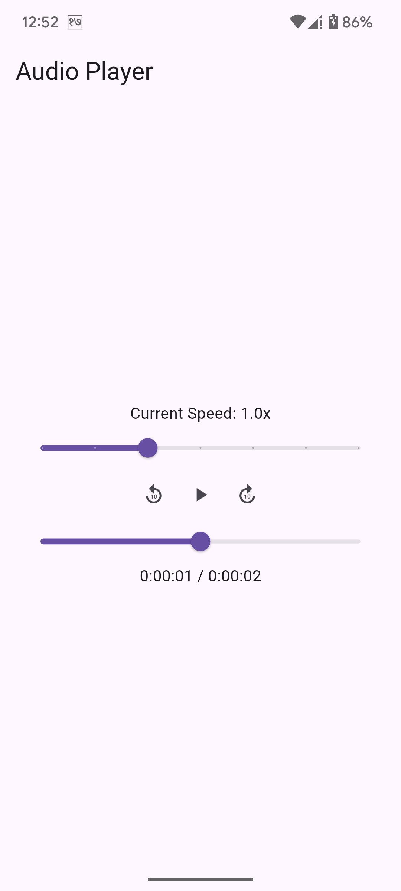

# 🎵 Audio Player Flutter App

This is a Flutter-based audio player app that plays a welcome audio once and then starts playing the main music on a loop. The user can control playback (play/pause, seek, rewind/forward, and playback speed).

---

## 🚀 Features

- Plays a **welcome audio** once on app launch
- Plays a **main looping music** track automatically after welcome
- Playback **speed control**
- **Play**, **pause**, **rewind**, **forward**, and **seek** functionality
- **Responsive UI** using `flutter_screenutil`
- **MobX** for clean state management

---

## 🛠️ Tech Stack

| Purpose            | Package             |
|--------------------|---------------------|
| Audio Playback     | [`just_audio`](https://pub.dev/packages/just_audio) |
| State Management   | [`mobx`](https://pub.dev/packages/mobx) + [`flutter_mobx`](https://pub.dev/packages/flutter_mobx) |
| Responsive Layout  | [`flutter_screenutil`](https://pub.dev/packages/flutter_screenutil) |

---

## 📁 Directory Structure

lib/
├── main.dart
└── ui/
    ├── feature/
    │   ├── view/
    │   │   └── feature_view.dart
    │   ├── view_model/
    │   │   └── feature_view_model.dart
    │   └── widgets/
assets/
├── audio/
│   ├── welcome.mp3
│   └── loop.mp3

---

## 🧑‍💻 Getting Started

### 1. Clone the Repository

```bash
git clone <your-repo-url>
cd <project-folder>
```

### 2. Install Dependencies

```bash
flutter pub get
```

### 3. Generate MobX Code

```bash
flutter pub run build_runner build
```

### 4. Run the App

```bash
flutter run
```

---

## 🎵 Add Audio Files

Make sure you add the following files to the `assets/audio/` directory:

- `assets/audio/welcome.mp3` – short audio played once at startup
- `assets/audio/loop.mp3` – main background music to loop

Update your `pubspec.yaml`:

```yaml
flutter:
  assets:
    - assets/audio/welcome.mp3
    - assets/audio/main_music.mp3
```

---

## 🧪 Usage Guide

### Controls

- ▶ **Play / Pause** – toggle playback
- ↺ **Rewind** – go back 1 seconds
- ↻ **Forward** – go forward 1 seconds
- **Seek Bar** – drag to change current time
- **Speed Control Slider** – adjust between 0.5x to 2.0x

---

## 📷 Screenshot



---

## 📌 Notes

- Only the **loop** loops, the welcome audio plays **once**.
- `just_audio` handles precise audio control and looping.

---

## 🧼 Clean Build (if needed)

```bash
flutter clean
flutter pub get
```

---

## ✅ Requirements

- Flutter 3.x
- Dart 3.x
- At least 4 GB RAM (6–8 GB recommended)
- Enough disk space for Gradle builds

## ✨ Author

Created by **[Krishna Thapa]**  
📧 [thapakrishnaji@gmail.com]
